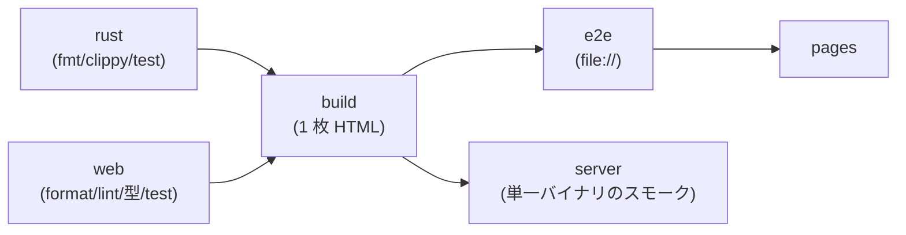

# CI の並べ方

**速くて確実なものから、遅くて確率的なものへ。** 前の段で落ちるものを
後ろの段で拾わない。骨は `assets/ci.yml`。



- 独立して並走: postgres / miri / kani / tla / sync / coverage / devcontainer
- 別スケジュール: mutants (毎日 03:00 JST)

## 全体にかける設定

```yaml
concurrency:                      # 同じブランチに続けて push したら古い実行を打ち切る
  group: ${{ github.workflow }}-${{ github.ref }}
  cancel-in-progress: true

permissions:
  contents: read                  # 既定は read。要るジョブだけで広げる

env:
  CARGO_TERM_COLOR: always
  RUST_BACKTRACE: 1
  NODE_VERSION: "22"
```

**ツールチェーンの版は 1 か所に集める。** Rust なら `rust-toolchain.toml`、
CI 側では `rustup show` を叩くだけにする。ワークフローに版を書くと二重管理になる。

## ジョブごとの要点

### build → e2e → pages を繋ぐ

配布物は 1 回だけ組んで artifact で回す。ジョブごとに組み直すと、
**検査したものと配るものが別物**になる。

```yaml
- uses: actions/upload-artifact@v7
  with: { name: dist, path: dist, if-no-files-found: error }
```

`if-no-files-found: error` を必ず付ける。空の artifact が静かに流れると、
下流が「何も無いもの」を検査して緑になる。

### server — 単一バイナリのスモークテスト

「配るのはバイナリ 1 つ」という前提そのものを検査する。起動 → 管理者と
トークンが出る → 認証が要る → トークンで通る → 作って読み返せる →
**画面が同じバイナリから返る** (仮ページではなく本物) まで通しで見る。

```sh
# 応答はいったんファイルに落としてから調べる。
# curl をそのまま grep -q に繋ぐと、大きな本文のときに grep が先に閉じて
# curl が「書けなかった」(23) と言って落ちる。← 実際に踏んだ
curl -sf -H "$auth" -o /tmp/me.json localhost:8080/v1/me
grep -q '"systemRole":"admin"' /tmp/me.json
```

### postgres — 本物の DB に当てる

SQLite だけで通すと、**方言の食い違いに気づかないまま配る**ことになる。
`services:` で本物を立て、環境変数があるときだけ走るテストにする
(手元では黙って飛ばす)。

```yaml
services:
  postgres:
    image: postgres:17
    options: >-
      --health-cmd "pg_isready -U postgres"
      --health-interval 5s --health-retries 10
```

### devcontainer — 「書いてある手順で動くか」

既存のジョブと同じ筋書きを、**Dev Container の中で**もう一度通す。
重複は承知の上で、開発環境が口伝に戻らないようにするのが目的。

```yaml
- uses: devcontainers/ci@v0.3
  with:
    configFile: .devcontainer/devcontainer.json
    push: never
    runCmd: |
      rustc --version && node --version && wasm-opt --version
      cargo xtask build --require-wasm-opt
      cargo test --workspace
```

**入っているべきものをまず名乗らせる。** ベースイメージが入れ替わったときに
そこで気づける。

### coverage — 閾値は全体で 1 つだけ

内訳はログに出し、判定は全体の行カバレッジ 1 つで行う。ファイルごとの
閾値は、置いた瞬間に例外リストの管理が始まる。

```sh
cargo llvm-cov --workspace --summary-only                      # 内訳を出す
cargo llvm-cov --workspace --summary-only --fail-under-lines 85 # 判定する
```

ビルド道具や FFI 層は数字を押し下げるが、**除くと「除いたところが腐る」**ので
入れたままにする。

TypeScript は Node の組み込みだけで測る (道具を増やさない)。読み込まれた
ファイルだけが数えられるので、DOM の要る `ui/` は対象外になる —
**純粋なモジュールだけ、という意味のある範囲**になる。

```json
"test": "node --experimental-strip-types --test \"src/**/*.test.ts\"",
"check": "npm run format:check && npm run lint && npm run typecheck && npm test"
```

## 落ちやすいところ (全部踏んだ)

| 症状 | 原因 | 手当て |
|---|---|---|
| ビルドが日によって壊れる | apt の binaryen が古い / 既定の機能集合が版ごとに違う | 公式リリースを版固定、`wasm-opt -Oz -all` |
| 外部取得が 5xx で落ちる | GitHub Releases は時々 504 | `curl --retry 5 --retry-all-errors`。curl を触れないもの (`cargo kani setup`) は**手順ごとループ** |
| `curl \| grep -q` が 23 で落ちる | 大きな本文で grep が先に閉じる | ファイルに落としてから grep |
| `--shard 4/4` が落ちる | `cargo mutants` の shard は **0 始まり** | `[0, 1, 2, 3]` |
| E2E が朝だけ落ちる | 実行日で結果が変わる | テスト内で時計を固定 |
| `npm run check` が通ったように見えた | `grep` で絞って Prettier の `[warn]` を見落とした | **`tail` で見る** |
| Windows のスモークが落ちる | Git Bash の `mktemp -d` が返す `/tmp/...` は Rust から読めない綴り | 保存先を**作業ディレクトリからの相対**にする |

## 何を PR ごとに回し、何を回さないか

| 頻度 | もの | 理由 |
|---|---|---|
| PR ごと | fmt / lint / 型 / 単体 / build / e2e / sync | 速い。落ちたら即直せる |
| PR ごと | miri / kani / TLA+ / coverage / devcontainer | 数分。**落ちる価値がある** |
| 毎日 | ミューテーションテスト | 重い。落ちても即座に直す種類ではない |
| タグ push | リリース一式 | [release-supply-chain](../release-supply-chain/) |

Dependabot は `github-actions` と各パッケージエコシステムに入れる。
**メジャーの自動追随で壊れることがある**ので、PR で CI を通してから入れる。

## 関連

- 各検査の中身 → [verification-ladder](../verification-ladder/)
- 配布 → [release-supply-chain](../release-supply-chain/)
