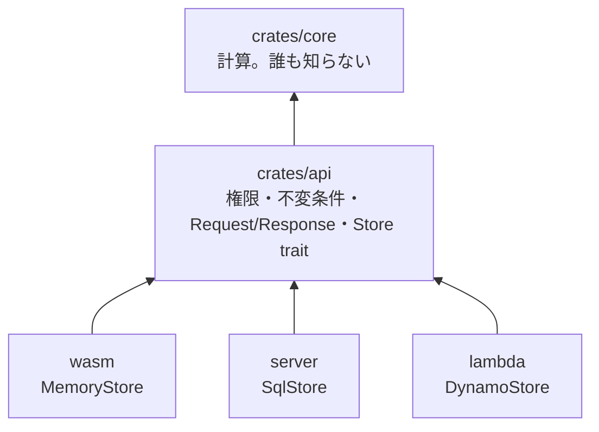
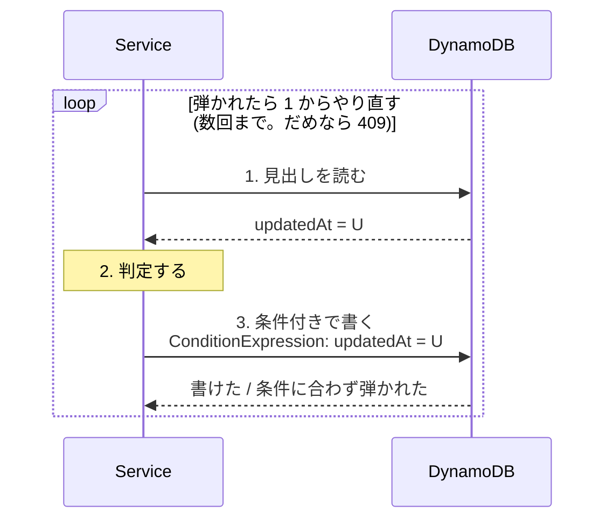

# 1 つのコアを 3 つの形で配る

ローカル版 (ブラウザの中だけで完結)、サーバ版 (バイナリ 1 つ)、クラウド版
(API Gateway + Lambda + DynamoDB)。**3 つ作るのではなく、1 つ作って 3 回配る。**



## 鉄則 1: 権限の判定は 1 か所だけ

**ローカル版でも同じコードを通す。** 画面側の出し分け (ボタンを隠す等) は
見た目の話でしかなく、判定ではない。

ローカル版では持ち主が自明なので判定は要らない、と考えて分岐を入れると、
**ローカルとサーバで挙動が違う**状態になる。判定は同じ場所に置いて、
「誰として呼ぶか」だけを外から与える。

暗号 (トークンのハッシュ等) は API 層に持ち込まない。API 層は
「呼び出し元は既に特定されている」前提で書く。WASM には認証の仕組みが要らない。

## 鉄則 2: `Store` は同期のままにする

AWS SDK は非同期、ブラウザの WASM は async を嫌う。ここで `Store` を
async にすると、**WASM まで async が波及して全部が汚れる**。

同期のまま書いて、非同期が要る側で `block_on` する。

```rust
// 実行器は起動時に 1 つ作って使い回す (呼び出しのたびに作らない)。
impl Store for DynamoStore {
    fn project_metas(&self) -> ApiResult<Vec<ProjectMeta>> {
        self.handle.block_on(async { /* SDK を呼ぶ */ })
    }
}
```

**`Handle::block_on` は非同期の文脈から呼ぶと落ちる。** 呼び出し側 (axum の
ハンドラ、Lambda 本体) は `spawn_blocking` の中で `dispatch` を呼ぶ。
この落とし穴は PostgreSQL のドライバでも踏んだ — 接続の組み立てを
実行器の外に出す必要があった。

## 鉄則 3: 保存先の適合テストは 1 組だけ

保存先が 2 つ以上になったら、**実装ごとにテストを書かない**。
約束を 1 か所に書いて、全実装に当てる。

```rust
// crates/api/src/store/conformance.rs
// 呼ぶたびに**まっさらな**ストアを返す関数を渡す。検査ごとに作り直す。
pub fn run_all(fresh: impl Fn() -> impl Store) { ... }

// それぞれの実装側で
mhc_api::store::conformance::run_all(|| MemoryStore::new());
```

**新しい保存先を足すときは、書く前にこれを通す。** 受け入れ基準を先に
固めないと、契約の食い違いに実装が終わるまで気づけない。

### 実際に食い違っていたもの

man-hour-calculator で適合テストを作ったとき、既に 2 実装が違っていた。

- `MemoryStore` だけが `put_project` で件数を数え直していた
- 権限の並びは `SqlStore` だけが正規化していた

どちらも **HTTP を通した先で初めて出る**種類の差で、単体テストでは出ない。
**同じ操作でローカル版とサーバ版の応答が違う状態**が、気づかれずに残っていた。

### 約束に何を書くか

「エラーにするか」「順序」「消したときの連鎖」が食い違いやすい。

| 種類 | 例 |
|---|---|
| upsert か | `put_*` は同じ id で二重に増えない |
| 戻り値の意味 | `remove_*` は「本当に消したか」を返す |
| 無いとき | 無い id は `None` / 空。エラーにしない |
| 連鎖 | アカウントを消すと権限と所属も消える。**グループを消しても配下は消さない** |
| 順序 | コメントは `(created_at, id)` 順。**並べるのは Store の仕事** |
| 数えない | 件数は渡された値をそのまま持つ。数え直さない |

逆に、**書かないこと**も明示する。一覧の並び (呼び出し側が並べ直す)、
同時書き込み (直列化は呼び出し側の仕事)。

## 鉄則 4: 一覧は中身を読まない

`project_metas()` が本文 (数十 KB になりうる) を**型として**含まない形に
しておく。これがあると DynamoDB で「見出し項目と中身項目を分ける」設計が
そのまま成り立つ。

**RDB のうちは気づかないが、クラウドに移した瞬間に効く。**
型で表現しておくと、うっかり本文を読む実装が書けない。

## クラウド版は「先に設計文書だけ」書く

実装せずに `docs/AWS.md` を書き下したことで、段 3-4 の設計がその形に
耐えるかを早く検査できた。書くのは:

1. 構成図 (何がどこを呼ぶか)
2. **そのまま使える層 / 書き直す層の表**
3. テーブル設計と引き方 (DynamoDB なら pk/sk と GSI)
4. 書き込みの競合をどう捌くか
5. 費用のあたり
6. **やらないこと**

### 書き込みの競合 (サーバ版と根本的に違う唯一の点)

サーバ版は `RwLock` で書き込みを直列化し、「読む → 判定 → 書く」の
不変条件を守れる。Lambda は同時に何本も動くのでその手は使えない。

**条件付き書き込み (楽観ロック) に置き換える。**



`Service` が「読む → 判定 → 書く」で完結していれば、**この繰り返しを
`Store` の外側に置くだけで `Service` は 1 行も変えなくてよい**。
そういう形に保っておくのが設計の仕事。

## 関連

- 権限の不変条件を TLA+ で検査する → [verification-ladder](../verification-ladder/)
- 認証まわり → [secure-defaults](../secure-defaults/)
