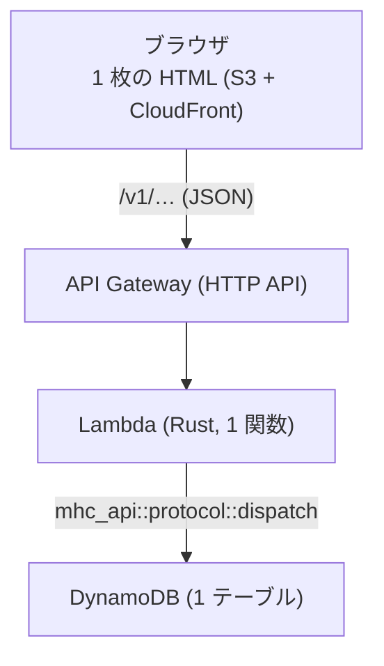
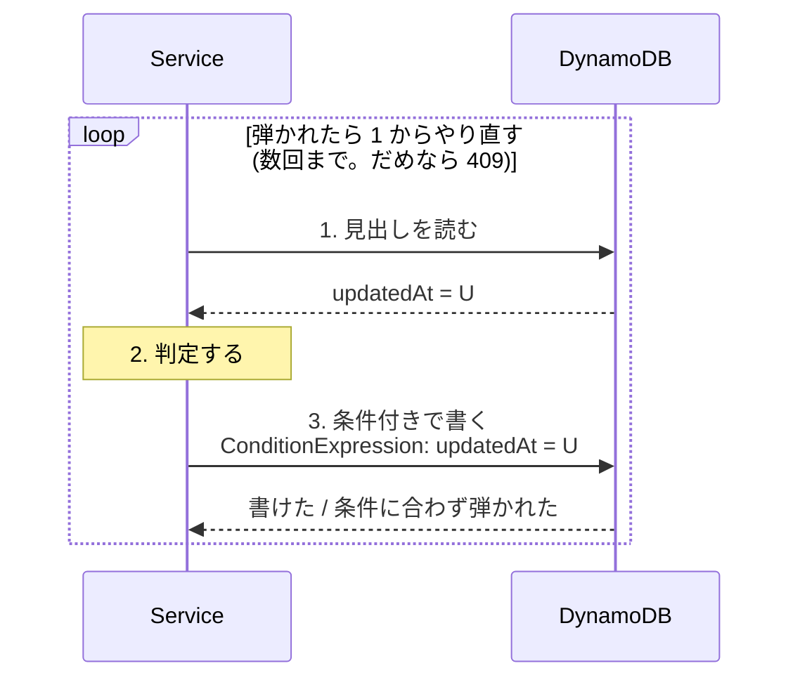

# AWS に置く

**まだ実装していない。** この文書は「そのまま実装に入れる粒度」で手順を
書き下したもの。`crates/api` と `crates/server` は、この構成が成り立つ形を
保ったまま作ってある。

社内サーバで足りるなら [SERVER.md](SERVER.md) のバイナリ 1 つで済む。
こちらは**常時動かすサーバを持ちたくない**場合の道。

## 構成



**計算は入らない。** 見積もりの計算はブラウザの WASM がその場で回すので、
Lambda はデータの置き場所と権限だけを見る。1 回の呼び出しは数 ms から
数十 ms で終わり、メモリも小さくて済む。

| | なぜ |
|---|---|
| API Gateway は **HTTP API** | REST API より安く、要るのはルーティングと CORS だけ |
| Lambda は **1 関数** | ルートごとに分けても、通る先は `dispatch` 1 つ。分けるほど冷えやすくなる |
| DynamoDB は **1 テーブル** | 引き方が決まっている (後述)。テーブルを分けると 1 回の呼び出しで複数のテーブルを跨ぐ |

## 何をそのまま使えるか

| 層 | いま | AWS で |
|---|---|---|
| 権限・不変条件 | `crates/api` の `Service` | **そのまま** |
| 操作とルートの対応 | `Request::route` / `ROUTES` | **そのまま** |
| HTTP → `Request` | `crates/server/src/http.rs` | 書き直す (axum → Lambda のイベント) |
| 保存先 | `SqlStore` | `DynamoStore` を書く |
| 認証 | `crates/server/src/auth.rs` | そのまま移せる (表 1 つ) |

つまり**新しく書くのは `Store` の実装とハンドラの外側だけ**。

## DynamoDB のテーブル設計

テーブル名 `mhc`。パーティションキー `pk`、ソートキー `sk`。

| 何 | `pk` | `sk` | 主な属性 |
|---|---|---|---|
| アカウント | `USER#<id>` | `META` | name, email, systemRole, createdAt |
| アカウントのグループ | `UGROUP#<id>` | `META` | name, createdAt |
| グループのメンバー | `UGROUP#<id>` | `MEMBER#<userId>` | — |
| 逆引き (所属) | `USER#<id>` | `UGROUP#<groupId>` | — |
| プロジェクトのグループ | `PGROUP#<id>` | `META` | name, createdAt |
| グループへの付与 | `PGROUP#<id>` | `ACCESS#<kind>#<id>` | role |
| プロジェクトの見出し | `PROJ#<id>` | `META` | name, groupId, dueDate, status, counts, updatedAt |
| プロジェクトの中身 | `PROJ#<id>` | `DOC` | document (JSON) |
| プロジェクトへの付与 | `PROJ#<id>` | `ACCESS#<kind>#<id>` | role |
| トークン | `TOKEN#<sha256>` | `META` | userId, label, createdAt, lastUsedAt |

**見出しと中身を別の項目に分ける**のが肝。一覧は見出しだけを読むので、
`document` (数十 KB になりうる) を読まずに済む。`Store::project_metas()` が
`document` を含まない形になっているのは、このため。

### 引き方

| 操作 | 引き方 |
|---|---|
| 1 件を開く | `Query(pk = PROJ#<id>)` … 見出し・中身・付与がまとめて取れる |
| 自分が見られる一覧 | GSI (下記) |
| グループの解決 | `Query(pk = USER#<id>, sk begins_with UGROUP#)` |
| トークンの照合 | `GetItem(pk = TOKEN#<sha256>)` … 1 回で済む |

### GSI: 「自分が見られるプロジェクト」

`project_metas()` の全件走査は、件数が増えると効かなくなる。逆引きの索引を 1 つ置く。

```
GSI1:  gsi1pk = PRINCIPAL#<kind>#<id>
       gsi1sk = PROJ#<projectId>
```

付与の項目 (`ACCESS#…`) にこの 2 つを持たせる。すると

1. 自分の所属グループを引く (`USER#<id>` の `UGROUP#` 前方一致)
2. 自分 + 所属グループそれぞれで GSI1 を引く → 触れるプロジェクト id と
   プロジェクトグループ id
3. プロジェクトグループ経由のぶんは、`PGROUP#<id>` を GSI2
   (`gsi2pk = PGROUP#<id>`) で引いて配下のプロジェクト id を足す
4. 集めた id の見出しを `BatchGetItem` で取る (100 件ずつ)

**システム管理者だけは全件走査になる**。`GSI3: gsi3pk = "PROJ"` を置いて
そこから引く (管理者の一覧は頻度が低いので、ページングで足りる)。

## 書き込みの競合

サーバ版は書き込みを `RwLock` で直列化して、「読む → 判定 → 書く」の
不変条件 (所有者が 1 人もいなくならない、など) を守っている。Lambda は
同時に何本も動くので、その手は使えない。

代わりに**条件付き書き込み (楽観ロック)** を使う。



`updatedAt` をそのまま版として使える。`Service` は「読む → 判定 → 書く」で
完結しているので、**この繰り返しを `Store` の外側に置けば `Service` は
1 行も変えなくてよい**。

付与の一覧 (`ACCESS#…`) は複数項目にまたがるので、`TransactWriteItems` で
まとめて書く。1 つのプロジェクトに収まるので 100 項目の上限には当たらない。

## Lambda のハンドラ

`Store` は同期のまま、AWS SDK は非同期。正攻法は「ブロックしてよい場所で
実行器を借りる」こと。

```rust
// 実行器は起動時に 1 つ作って使い回す (呼び出しのたびに作らない)。
static RUNTIME: OnceLock<Runtime> = OnceLock::new();

impl Store for DynamoStore {
    fn project_metas(&self) -> ApiResult<Vec<ProjectMeta>> {
        self.block_on(async { /* SDK を呼ぶ */ })
    }
}

impl DynamoStore {
    fn block_on<T>(&self, task: impl Future<Output = T>) -> T {
        self.handle.block_on(task)
    }
}
```

`Handle::block_on` は**非同期の文脈から呼ぶと落ちる**ので、Lambda 本体は
`spawn_blocking` の中で `dispatch` を呼ぶ。`crates/server` と同じ形。
(この落とし穴は PostgreSQL のドライバでも踏んだ。`store/postgres.rs` の
`connect` の注意書きを参照。)

冷えた状態からの起動を短くするため、`provided.al2023` (`cargo lambda`) を使い、
`[profile.server]` と同じく `panic = "unwind"` にする。

## 静的ファイル

`dist/index.html` (紹介ページ) と `dist/app.html` (道具) を S3 に置き、
CloudFront から配る。

- `index.html` は `Cache-Control: no-cache` (中身の更新をすぐ届けるため)
- `/v1/*` は API Gateway に向ける (オリジンを分ける)

同一オリジンにすれば CORS は要らない。別オリジンにするなら、HTTP API の
CORS 設定で `Authorization` ヘッダを許可する。

## 認証

サーバ版と同じ。`Authorization: Bearer`、保存するのは SHA-256 のハッシュ。
`TOKEN#<sha256>` で 1 回引けるので、DynamoDB でもそのまま成り立つ。

「最後に使った日」の更新は 1 日 1 回に抑えてあるので、読み取りのたびに
書き込みが走ることはない。

発行は Lambda では行わず、管理用の小さなコマンド (ローカルから DynamoDB を
直接叩く) に置く。サーバ版で CLI にしたのと同じ理由で、「配る権限を持つ人」を
API の外に置いておきたいため。

## 費用のあたり

100 人・1 日 1 人 200 回の呼び出しとして、月 60 万リクエスト。

- API Gateway (HTTP API): $1 / 100 万 → **$0.6**
- Lambda: 128MB・平均 20ms → **$0.1 未満** (無料枠内に収まることが多い)
- DynamoDB: オンデマンドで数 GB・読み書き数百万 → **$2 前後**
- CloudFront + S3: 1 ファイル、キャッシュが効く → **$1 未満**

月 $5 に届かない。**常時動くサーバを持たないこと**がそのまま効く。

## やらないこと

- **計算をサーバに移すこと。** クライアントで回すからこの構成が軽く済む。
  移した瞬間に Lambda の時間とメモリが跳ね上がる
- **`Service` を非同期にすること。** WASM まで async が波及する。
  同期のまま `block_on` で足りる
- **テーブルを分けること。** 1 回の呼び出しで跨ぐ必要が出る

## 手順

1. `crates/store-dynamo` (または `crates/server` の feature) に `DynamoStore` を書く
2. 楽観ロックの繰り返しを `Store` の外側 (`retry` ラッパ) に置く
3. `crates/lambda` に `cargo lambda` のハンドラを書く。ルートの対応は
   `ROUTES` をそのまま使う
4. テーブルと GSI を作る (CDK か Terraform)
5. `crates/server/tests/api.rs` と同じ筋書きを DynamoDB Local に対して回す
6. S3 + CloudFront に `dist/` を置く
